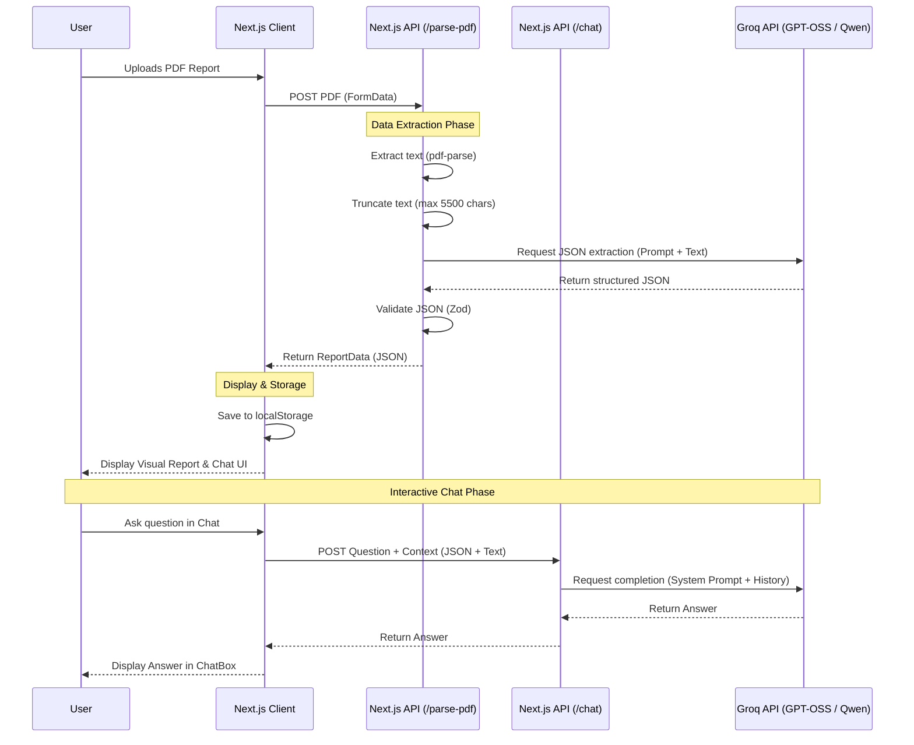

# Architecture Overview

Labmate is built as a modern Next.js 16 (App Router) web application. It processes PDF lab reports, parses their text, and uses Groq-hosted open-source LLMs to convert that text into a structured, easily readable dashboard. It also features a RAG-like Chat interface for users to ask questions about their reports.

## System Architecture

## Key Components

1. **Frontend (Next.js Client):**
   - Built with Tailwind CSS, Lucide icons, and Framer Motion.
   - PWA ready via `next-pwa`.
   - Uses `localStorage` to cache reports so users can access history without a database.
   
2. **Backend (Next.js API Routes):**
   - `/api/parse-pdf`: Handles file uploads (up to 10MB), uses `pdf-parse` (externalized via `serverExternalPackages`), and invokes the LLM.
   - `/api/chat`: A stateless endpoint that takes the report context and user query, formats a strict lifestyle-only system prompt, and returns a safe response.

3. **AI Fallback Chain (`lib/groq.ts`):**
   - Automatically handles Groq API rate limits (like TPM/RPM limits) and decommissioned models.
   - Attempts extraction using a predefined array of fast, open-source models: `openai/gpt-oss-20b` -> `openai/gpt-oss-120b` -> `qwen/qwen3.6-27b` -> `groq/compound-mini`.
   - Limits `max_tokens` and truncates input strictly to avoid free-tier `413 Request too large` errors.

4. **Data Validation (`lib/schemas.ts`):**
   - Zod is used to guarantee that the LLM returns properly shaped JSON (status enums, required string arrays) before returning it to the client.
